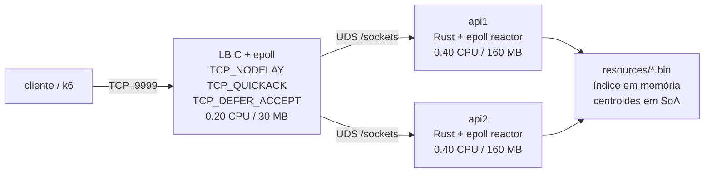
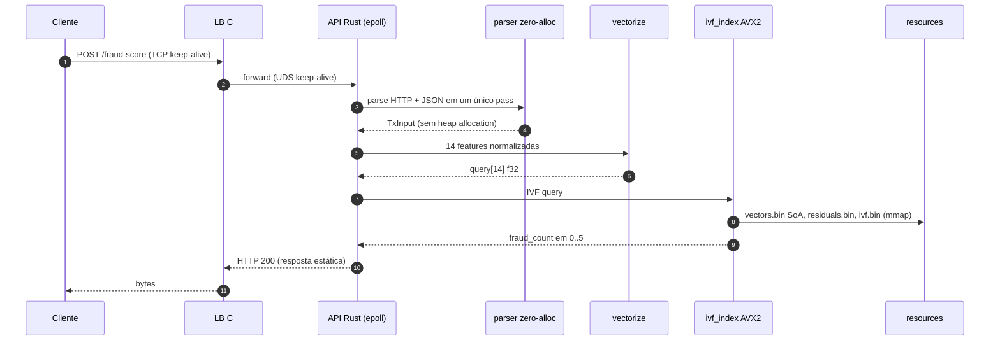
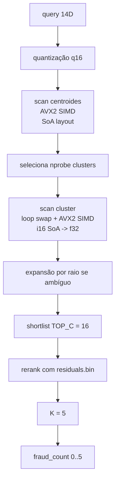

# Documentação técnica

Este documento descreve a arquitetura e o hot path da solução atual. A API transforma a transação em um vetor e consulta um índice vetorial pré-processado. As otimizações de I/O e CPU foram calibradas para a máquina da rinha

## Topologia



LB e APIs compartilham o volume nomeado `sockets`. As APIs criam `/sockets/api{1,2}.sock` na inicialização, e o LB se conecta a esses paths. No caminho interno não há TCP; só Unix domain socket.

## Fluxo da requisição



Endpoints expostos:

- `GET /ready`: sinaliza readiness depois do carregamento e do warmup do índice.
- `POST /fraud-score`: classifica a transação.

Falhas de parse ou payload inválido retornam uma resposta conservadora com `fraud_score = 1.0`. A API ainda responde com HTTP 200 para não perder pontos no score da competição por erro de protocolo.

## Recursos binários

O runtime depende dos arquivos em `resources/`:

| Arquivo | Conteúdo |
| --- | --- |
| `vectors.bin` | matriz SoA de vetores quantizados em `i16` (`dim * n_vecs + idx`) |
| `labels.bin` | label de fraude/legítimo, 1 byte por referência |
| `residuals.bin` | ajuste `i8` por dimensão para o rerank refinado |
| `ivf.bin` | magic, metadados, centroides AoS, raios e boundaries dos clusters |
| `normalization.json` | escala e limites usados na normalização |
| `mcc_risk.json` | risco base por MCC |

No startup, cada API carrega esses binários uma vez, reorganiza os centroides para SoA alinhado a 8 lanes, faz um warmup curto e passa a atender requisições sem reler os dados.

## Vetorização

A transação vira um vetor de 14 dimensões:

1. valor da transação;
2. número de parcelas;
3. relação entre `amount` e média do cliente;
4. hora do dia;
5. dia da semana;
6. minutos desde a última transação;
7. distância da última transação;
8. distância da casa;
9. transações nas últimas 24h;
10. flag `is_online`;
11. flag `card_present`;
12. merchant desconhecido para o cliente;
13. risco do MCC;
14. média histórica do merchant.

Valores numéricos são limitados às faixas conhecidas em `normalization.json`; campos ausentes usam defaults conservadores. O índice trabalha com escala `q16`, ou seja, valores normalizados quantizados para `[-32767, 32767]`.

## Índice IVF



Parâmetros atuais no código:

| Parâmetro | Valor |
| --- | --- |
| Dimensões | `14` |
| Top-K final | `5` |
| Shortlist coarse | `16` |
| Máximo de clusters | `8192` |
| Máximo de probes | `24` |
| SIMD lanes (`_mm256_*`) | `8 f32` |
| Gap de empate coarse | `512.0` |

### Scan de centroides (AVX2)

Centroides são reorganizados de AoS (`c * 14 + d`) para SoA (`d * n_clusters_padded + c`), com `n_clusters_padded` arredondado para múltiplo de 8. Para cada query:

```text
for chunk in (0..n_padded).step_by(8):
    acc = _mm256_setzero_ps()
    for d in 0..14:
        q_d  = _mm256_set1_ps(query[d])             # broadcast
        c_d  = _mm256_loadu_ps(centroids_soa[d, chunk..chunk+8])
        diff = _mm256_sub_ps(q_d, c_d)
        acc  = _mm256_fmadd_ps(diff, diff, acc)
    _mm256_storeu_ps(dist[chunk..chunk+8], acc)
```

Resultado: cada iteração produz 8 distâncias quadráticas. Assim, `8192 * 14` MULs viram `1024 * 14` FMAs SIMD, algo em torno de 5 a 7 vezes mais rápido que o loop escalar autovetorizado.

### Scan de cluster (loop swap + AVX2)

`vectors.bin` fica em SoA por dimensão (`dim * n_vecs + idx`). O código original fazia `for idx { for d {...} }`, o que gera acessos com stride de `n_vecs * 2 bytes = 6 MB` por dimensão e castiga o cache. O código atual inverte os loops:

```text
for d in 0..14:
    q_d = _mm256_set1_ps(query[d])
    base = d * n_vecs + start
    for chunk in (0..n).step_by(8):
        raw  = _mm_loadu_si128(dims[base + chunk..])  # 8 i16
        v32  = _mm256_cvtepi16_epi32(raw)             # 8 i32
        vps  = _mm256_cvtepi32_ps(v32)                # 8 f32
        diff = _mm256_sub_ps(q_d, vps)
        acc  = _mm256_loadu_ps(scratch[chunk..])
        new  = _mm256_fmadd_ps(diff, diff, acc)
        _mm256_storeu_ps(scratch[chunk..], new)
```

Para um cluster típico de ~1500 vetores, isso lê ~10 KB sequenciais em L1, contra 168 KB com stride no código original, e processa 8 distâncias por instrução FMA. O scratch buffer é `thread_local`, o que evita `malloc` na hot path.

Etapas finais:

1. Top-16 candidatos atualizados a partir do `scratch` por inserção em heap fixo.
2. Se houver ambiguidade (mistura fraude/legítimo nos top-5 ou shortlist incompleto), expansão de clusters cujo `lower_bound_sq` ainda permite um vizinho melhor.
3. Rerank dos 16 candidatos com `residuals.bin` em `i32` para ganhar precisão.
4. `fraud_count` = quantos dos top-5 refinados são fraude.

## Reactor da API

Cada API é um processo Rust single-thread com `mio::Poll` registrando dois listeners (TCP em `0.0.0.0:8080` para fallback e UDS em `/sockets/api{1,2}.sock` para o caminho competitivo). As conexões vivem em um `HashMap<Token, Conn>` indexado por token incremental. Cada conexão guarda um buffer de leitura de `8 KB`, a posição de escrita e o interest atual.

Estados:

```text
ACCEPT  -> registra READABLE (TCP_NODELAY + TCP_QUICKACK no fd TCP)
READ    -> drain até WouldBlock; se request HTTP completo, gera resposta
WRITE   -> tenta send imediato; se EAGAIN, registra WRITABLE
KEEP    -> após resposta, volta a READ; pipelining suportado pelo loop interno
```

Não existe thread por conexão nem alocação por requisição, e a resposta HTTP já fica pré-computada em um `&'static [u8]`.

## Load balancer

`lb/lb.c` é um proxy `epoll` em C com ~300 linhas:

- Aceita TCP em `:9999` com `TCP_DEFER_ACCEPT`, então o kernel só acorda o `accept` quando já há bytes do cliente.
- Em cada `accept`, aplica `TCP_NODELAY` e `TCP_QUICKACK` no fd TCP.
- Para cada cliente, abre uma conexão Unix domain socket ao backend escolhido em round-robin (`unix:/sockets/apiN.sock`). Como o salto interno é UDS, o tráfego pula o stack TCP/IP: sem checksums, headers, encapsulation ou routing.
- Faz `read`/`write` 1:1 entre os dois fds com buffer de `8 KB`. Não há alocação por requisição; FDs e `Conn*` ficam em uma `fdtab` indexada por fd.
- Suporta keep-alive nos dois lados.

## Respostas

A resposta vem de uma tabela estática:

| Score | Resposta |
| --- | --- |
| `0` | `{"approved":true,"fraud_score":0.0}` |
| `1` | `{"approved":true,"fraud_score":0.2}` |
| `2` | `{"approved":true,"fraud_score":0.4}` |
| `3` | `{"approved":false,"fraud_score":0.6}` |
| `4` | `{"approved":false,"fraud_score":0.8}` |
| `5` | `{"approved":false,"fraud_score":1.0}` |

As strings HTTP já incluem `Content-Length` e `Connection: keep-alive`, o que evita alocação e formatação por requisição.

## Otimizações específicas para Haswell / Mac Mini Late 2014

- `target-cpu = x86-64-v3` habilita AVX2, FMA, BMI1/2 e `popcnt` por padrão, que é a baseline mínima da máquina da rinha.
- O scan IVF usa intrinsics `_mm256_*` explícitos. Com 14 dimensões, cada FMA processa 8 distâncias, e o ciclo de 1 cycle/op da Haswell empurra o loop para um limite de memória, não de CPU.
- O dataset (84 MB de `vectors.bin`) passa muito do L3 de 3 MB do i5-4278U. O loop swap garante que cada scan de cluster toque só ~10 KB sequenciais por dimensão, o que cabe em L1 (32 KB por core).
- O reactor single-thread cabe no orçamento de `0.40 CPU` por API sem custo de context switch interno.
